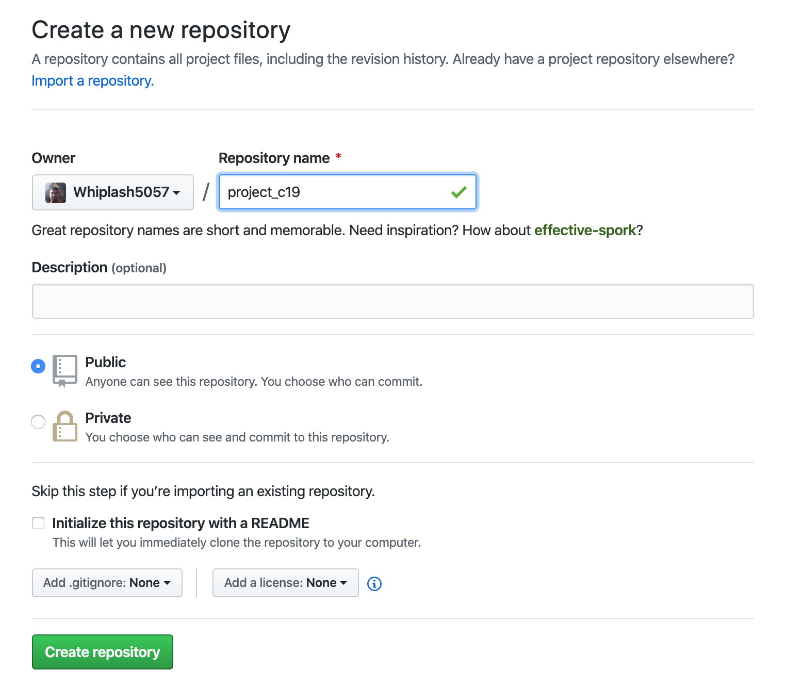
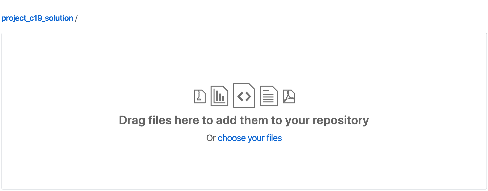
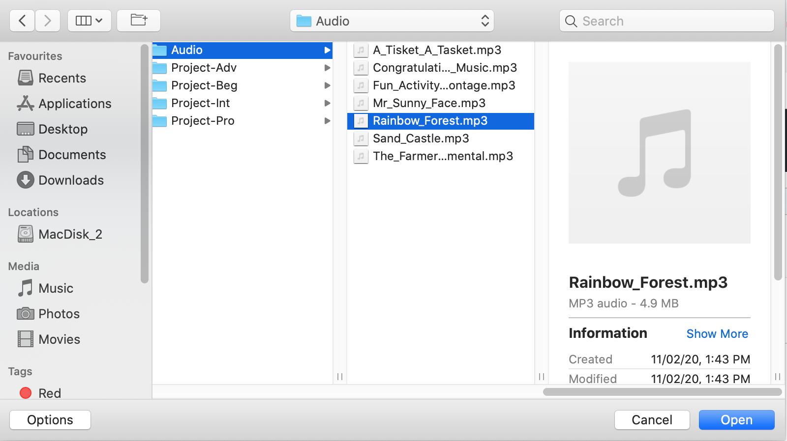
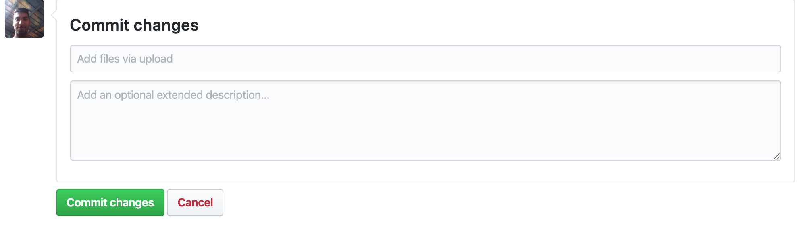
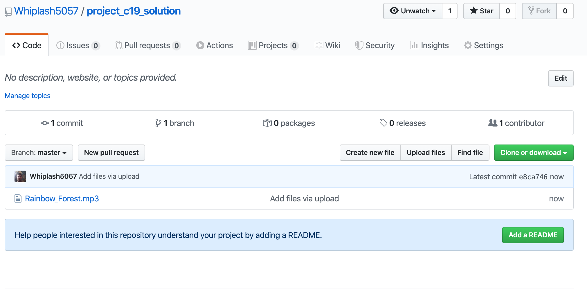

# USE GITHUB
#### Title: "Upload files to GITHUB"
#### Description: "GITHUB allows you to upload files to the cloud. Your friends can take a look at what you've made."
---

## Create a repository: 

- Click the "Plus" button on the header.
- Click on "Create a new Repository".

 
 
 
 
 ## Name your repository:

-  Give your repository a name
-  Click on "Create Repository".

 
 
 
 
 ## Upload your files:

- Click on "upload an existing file".
- Choose the files you want to upload into the repository.

 
 
 
 
 ## Save your files to the cloud.

- Click on "Commit Changes"

 
 
 
 
## You did it: Congratulations! Your product is out in the market.

